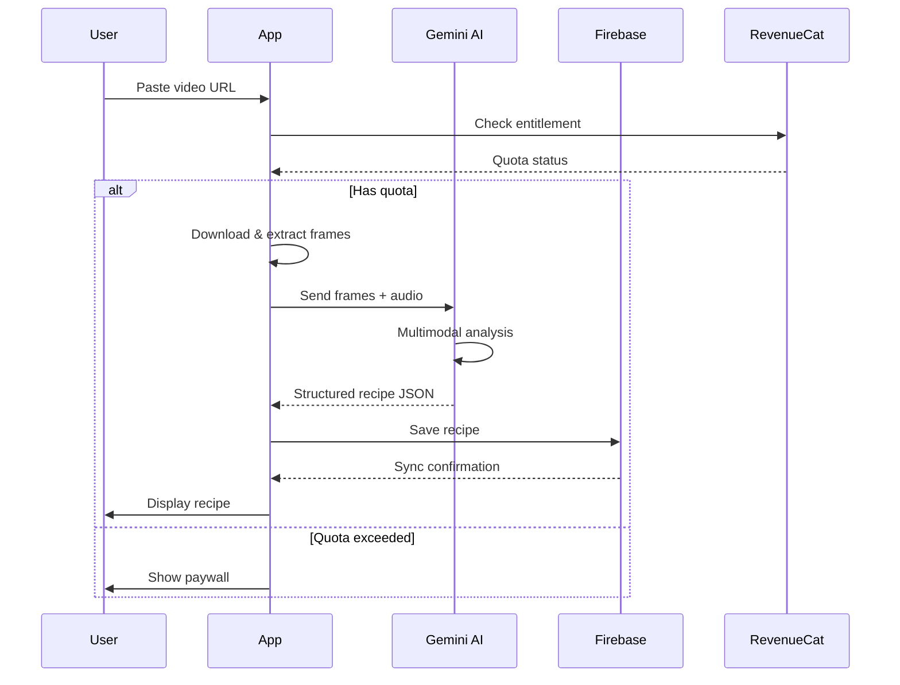

# 🍳 SousChef

> **AI-Powered Culinary Assistant for Modern Cooks**

Transform social media recipe videos into structured, actionable recipes with the power of AI. SousChef helps you discover, organize, and execute recipes with voice-guided cooking assistance, smart shopping lists, and cloud synchronization.

[](https://reactnative.dev/)
[](https://expo.dev/)
[](https://www.typescriptlang.org/)
[](https://www.revenuecat.com/)
[](LICENSE)

---

## 📱 About The Project

**SousChef** is a React Native mobile application that revolutionizes recipe management by leveraging AI to extract structured recipes from TikTok, Instagram, and YouTube cooking videos. Built for the [RevenueCat Shipyard Creator Contest](https://revenuecat-shipyard.devpost.com/), SousChef demonstrates seamless subscription management and monetization through RevenueCat's powerful SDK.

### 🎯 Core Problems Solved

- **Recipe Fragmentation**: Users save recipes across screenshots, bookmarks, and notes with no central organization
- **Video-to-Action Gap**: Cooking videos are entertaining but difficult to follow in real-time
- **Hands-Free Cooking**: Traditional recipe apps require constant screen interaction while cooking
- **Shopping List Chaos**: Manually creating shopping lists from multiple recipes is time-consuming

### 🌟 Key Features

#### 🤖 AI-Powered Video Import
- Paste any TikTok, Instagram, or YouTube recipe video URL
- Google Gemini 1.5 Flash extracts ingredients, steps, and timing automatically
- Multimodal AI analyzes both visual cues and audio transcription
- Structured JSON output with ingredient amounts, prep times, and cooking instructions

#### 🎤 Voice-Activated Cooking Mode
- Completely hands-free recipe navigation
- "Next step", "Set timer", "Double recipe" voice commands
- Real-time speech recognition using native device capabilities
- Perfect for messy hands while cooking

#### 🗓️ AI-Powered Meal Planning

- **Automatic Plan Generation**: AI creates personalized weekly meal plans on first visit
- **Dietary Integration**: Respects user allergies and dietary restrictions from profile
- **Smart Pantry Usage**: Prioritizes expiring pantry items to reduce food waste
- **Meal Editing**: Remove, replace, or add individual meals with confirmation dialogs
- **Recipe Overlap Optimization**: Maximizes ingredient overlap between recipes for efficient shopping
- **Shopping List Generation**: Auto-generates categorized shopping lists from meal plans
- **Waste Tracking**: Monitor food waste and savings from meal planning (Pro feature)

#### 🛒 Intelligent Shopping Lists

- Auto-aggregate ingredients from multiple recipes and meal plans
- Cross-check with pantry inventory to avoid duplicates
- Organize by store sections (Produce, Dairy, Meat, etc.)
- Track items already in pantry vs. items to buy
- Share lists with family members (Pro feature)

#### ⏰ Multi-Timer Management
- Run unlimited concurrent cooking timers
- Custom labels for each timer ("Pasta", "Sauce", "Oven")
- Background notifications when timers complete
- Voice control integration

#### ☁️ Cloud Sync & Offline Mode
- Firebase backend for cross-device synchronization
- Offline-first architecture - core features work without internet
- Automatic conflict resolution for concurrent edits
- Secure user authentication

#### 💎 Premium Subscriptions (RevenueCat)
- Free tier: 5 AI imports per month
- **SousChef Pro**: Unlimited imports, cloud sync, advanced features
- Seamless iOS and Android subscription management
- Cross-platform purchase restoration

---

## 🏗️ Tech Stack

### Frontend
- **React Native** (0.73+) - Cross-platform mobile framework
- **Expo SDK 50+** - Managed workflow, OTA updates, EAS Build
- **TypeScript** - Type-safe development
- **NativeWind** - TailwindCSS for React Native
- **React Navigation 6** - Navigation and routing

### State Management
- **Zustand** - Lightweight state management (<1KB)
- **AsyncStorage** - Local persistence
- **React Query** - Server state management

### Backend & Services
- **Firebase** (Firestore + Auth) - Backend infrastructure
- **Google Gemini 1.5 Flash** - Multimodal AI processing
- **RevenueCat** - Subscription and entitlement management

### Native Integrations
- **react-native-voice** - Speech recognition
- **expo-notifications** - Push notifications & timers
- **expo-av** - Audio/video processing

### DevOps
- **EAS Build** - Cloud builds for iOS and Android
- **GitHub Actions** - CI/CD automation
- **Sentry** - Error tracking and monitoring

---

## 📦 Installation

### Prerequisites

- Node.js 18+ and npm/yarn
- Expo CLI (`npm install -g expo-cli`)
- iOS Simulator (Mac) or Android Studio
- Firebase project with Firestore and Authentication enabled
- Google Gemini API key
- RevenueCat account with configured products

### 1. Clone Repository

```bash
git clone https://github.com/dbisina/SousChef.git
cd SousChef
```

### 2. Install Dependencies

```bash
# Install root dependencies
npm install

# Navigate to mobile package
cd packages/mobile
npm install
```

### 3. Environment Configuration

Create `.env` file in `packages/mobile/`:

```env
# Firebase Configuration
EXPO_PUBLIC_FIREBASE_API_KEY=your_firebase_api_key
EXPO_PUBLIC_FIREBASE_AUTH_DOMAIN=your_project.firebaseapp.com
EXPO_PUBLIC_FIREBASE_PROJECT_ID=your_project_id
EXPO_PUBLIC_FIREBASE_STORAGE_BUCKET=your_project.appspot.com
EXPO_PUBLIC_FIREBASE_MESSAGING_SENDER_ID=your_sender_id
EXPO_PUBLIC_FIREBASE_APP_ID=your_app_id

# Google Gemini API
EXPO_PUBLIC_GEMINI_API_KEY=your_gemini_api_key

# RevenueCat API Keys (stored in secure storage)
REVENUECAT_IOS_API_KEY=your_ios_key
REVENUECAT_ANDROID_API_KEY=your_android_key
```

### 4. Firebase Setup

1. Create a new Firebase project at [console.firebase.google.com](https://console.firebase.google.com)
2. Enable **Firestore Database** and **Authentication** (Email/Password)
3. Add iOS and Android apps in Firebase project settings
4. Download and place configuration files:
   - iOS: `GoogleService-Info.plist` → `packages/mobile/ios/`
   - Android: `google-services.json` → `packages/mobile/android/app/`

### 5. RevenueCat Configuration

1. Create account at [revenuecat.com](https://www.revenuecat.com)
2. Configure products:
   - **Product ID (iOS)**: `souschef_monthly`, `souschef_annual`
   - **Product ID (Android)**: `souschef_monthly`, `souschef_annual`
3. Create entitlement: `pro_access`
4. Link products to entitlement
5. Copy API keys to environment variables

### 6. Run Development Server

```bash
# Start Expo development server
npx expo start

# Run on iOS simulator
npx expo run:ios

# Run on Android emulator
npx expo run:android

# Scan QR code with Expo Go app for physical device testing
```

---

## 🚀 Usage

### Importing Recipes from Videos

1. **Open SousChef** and navigate to the Cookbook screen
2. **Tap the "+" button** in the top right
3. **Select "Import from URL"**
4. **Paste a recipe video URL** (TikTok, Instagram, YouTube)
5. **Wait 2-3 seconds** for AI processing
6. **Review and edit** the extracted recipe
7. **Save to your cookbook**


### Voice-Activated Cooking

1. **Open a recipe** from your cookbook
2. **Tap "Start Cooking"** button
3. **Enable microphone** when prompted
4. **Say voice commands**:
   - *"Next step"* - Advance to next instruction
   - *"Previous step"* - Go back one step
   - *"Set timer 10 minutes"* - Start a 10-minute timer
   - *"Double the recipe"* - Scale all ingredients 2x
   - *"Add to shopping list"* - Add ingredients to shopping list
   - *"Pause"* - Pause voice recognition

### Creating Shopping Lists

1. **Select recipes** you want to cook this week
2. **Tap "Add to Shopping List"** on each recipe
3. **Navigate to Shopping tab**
4. **Review aggregated ingredients**
5. **Check off items** as you shop
6. **Share list** with family (Pro feature)

### Managing Subscriptions

**Free Tier:**
- 5 AI recipe imports per month
- Local-only storage (no cloud sync)
- Basic timers

**SousChef Pro ($4.99/month or $39.99/year):**
- Unlimited AI imports
- Cloud synchronization across devices
- Advanced multi-timer management
- Shopping list sharing
- Offline recipe access (unlimited)
- Priority support

**Upgrade Flow:**
1. Attempt to import 6th recipe
2. Paywall appears automatically
3. Choose monthly or annual plan
4. Complete purchase via App Store / Play Store
5. Pro features unlock immediately

---

## 🏛️ Architecture

### High-Level Overview

```
┌─────────────────────────────────────────────────────────┐
│                   React Native App                       │
│  ┌────────────┐ ┌────────────┐ ┌────────────┐          │
│  │  Screens   │ │ Components │ │ Navigation │          │
│  └─────┬──────┘ └──────┬─────┘ └──────┬─────┘          │
│        │               │               │                 │
│  ┌─────▼───────────────▼───────────────▼─────┐          │
│  │         Zustand State Management           │          │
│  └─────┬──────────────────────────────────────┘          │
│        │                                                  │
│  ┌─────▼──────────┐  ┌──────────────┐                   │
│  │  API Services  │  │ Local Storage│                   │
│  └────┬───────────┘  └──────────────┘                   │
└───────┼──────────────────────────────────────────────────┘
        │
    ┌───▼────────────────────────────────────┐
    │     External Services Layer            │
    │  ┌──────────┐ ┌──────────┐ ┌─────────┐│
    │  │ Firebase │ │  Gemini  │ │RevenueCat││
    │  │(Auth/DB) │ │(AI/ML)   │ │ (IAP)   ││
    │  └──────────┘ └──────────┘ └─────────┘│
    └────────────────────────────────────────┘
```

### Data Flow: Video-to-Recipe



### Project Structure

```
SousChef/
├── packages/
│   ├── mobile/                  # React Native app
│   │   ├── src/
│   │   │   ├── screens/        # Screen components
│   │   │   ├── components/     # Reusable UI components
│   │   │   ├── navigation/     # Navigation configuration
│   │   │   ├── stores/         # Zustand state stores
│   │   │   ├── services/       # API integrations
│   │   │   ├── hooks/          # Custom React hooks
│   │   │   ├── utils/          # Helper functions
│   │   │   ├── types/          # TypeScript interfaces
│   │   │   └── constants/      # App constants
│   │   ├── app.json            # Expo configuration
│   │   ├── eas.json            # EAS Build configuration
│   │   └── package.json
│   └── functions/               # Firebase Cloud Functions
│       └── src/
│           └── revenuecat-webhook.ts
├── docs/                        # Documentation
│   ├── technical-documentation.html
│   └── PERFORMANCE_OPTIMIZATION.md
├── CHANGELOG.md                 # Version history and changes
├── .github/
│   └── workflows/              # CI/CD workflows
│       └── build.yml
├── README.md
└── LICENSE
```

---

## 💰 RevenueCat Integration

### Why RevenueCat?

SousChef uses **RevenueCat** as the backbone of its monetization strategy to abstract the complexity of iOS and Android in-app purchases. Key benefits:

- **Cross-platform subscription management** - Single SDK for iOS and Android
- **Entitlement system** - Feature flags based on subscription status
- **Server-side receipt validation** - No client-side hacks
- **Analytics dashboard** - MRR, churn, LTV tracking out-of-the-box
- **Webhooks** - Real-time events for backend sync

### Implementation Highlights

#### 1. SDK Initialization

```typescript
// App.tsx
import Purchases from 'react-native-purchases';

useEffect(() => {
  const initRevenueCat = async () => {
    if (Platform.OS === 'ios') {
      await Purchases.configure({ apiKey: REVENUECAT_IOS_KEY });
    } else {
      await Purchases.configure({ apiKey: REVENUECAT_ANDROID_KEY });
    }
  };
  initRevenueCat();
}, []);
```

#### 2. Entitlement Check

```typescript
// Check before allowing AI import
const { customerInfo } = await Purchases.getCustomerInfo();
const isPro = customerInfo.entitlements.active['pro_access'] !== undefined;

if (!isPro && importCount >= 5) {
  showPaywall();
  return;
}
```

#### 3. Purchase Flow

```typescript
// PaywallScreen.tsx
const handlePurchase = async (pkg: PurchasesPackage) => {
  try {
    const { customerInfo } = await Purchases.purchasePackage(pkg);

    if (customerInfo.entitlements.active['pro_access']) {
      navigation.goBack();
      showSuccessToast('Welcome to SousChef Pro! 🎉');
    }
  } catch (error) {
    if (!error.userCancelled) {
      showErrorToast('Purchase failed');
    }
  }
};
```

#### 4. Webhook Handler (Firebase Function)

```typescript
// Sync RevenueCat events to Firebase
export const onRevenueCatEvent = functions.https.onRequest(async (req, res) => {
  const event = req.body;

  switch (event.type) {
    case 'INITIAL_PURCHASE':
    case 'RENEWAL':
      await updateUserEntitlement(event.app_user_id, true);
      break;
    case 'CANCELLATION':
      await updateUserEntitlement(event.app_user_id, false);
      break;
  }

  res.status(200).send('OK');
});
```

### Subscription Products

| Product ID | Platform | Price | Duration | Features |
|------------|----------|-------|----------|----------|
| `souschef_monthly` | iOS/Android | $4.99 | 1 month | All Pro features |
| `souschef_annual` | iOS/Android | $39.99 | 1 year | All Pro features (33% savings) |

### Entitlement Configuration

- **Entitlement ID**: `pro_access`
- **Attached Products**: `souschef_monthly`, `souschef_annual`
- **Features Unlocked**: Unlimited imports, cloud sync, sharing, advanced timers

---

## 🤖 AI Processing

### Google Gemini 1.5 Flash

We chose **Gemini 1.5 Flash** for its exceptional multimodal capabilities:

- **1M token context window** - Process entire recipe videos in one request
- **Multimodal understanding** - Analyze video frames + audio simultaneously
- **Low latency** - ~1.8 second average processing time
- **Cost-effective** - 10x cheaper than GPT-4 Vision

### Processing Pipeline

1. **Frame Extraction**: Extract 5 key frames at 0%, 25%, 50%, 75%, 100% of video
2. **Audio Transcription**: Convert speech to text using native device APIs
3. **Multimodal Analysis**: Send frames + transcript to Gemini with structured prompt
4. **JSON Generation**: AI outputs structured recipe JSON matching our TypeScript schema
5. **Validation**: Zod schema validation ensures type safety
6. **Storage**: Save to Firestore with user metadata

### Prompt Engineering

Our prompt specifically instructs Gemini to:
- Infer ingredient amounts from visual cues (measuring cups, container sizes)
- Extract timing from both spoken words and visual timer displays
- Maintain chronological order of cooking steps
- Identify cuisine type, difficulty, and serving size
- Format output as strict JSON matching our schema

### Example Output

```json
{
  "title": "Creamy Garlic Pasta",
  "description": "Quick 15-minute pasta with rich garlic cream sauce",
  "ingredients": [
    { "name": "Pasta", "amount": "1", "unit": "lb", "preparation": "" },
    { "name": "Butter", "amount": "4", "unit": "tbsp", "preparation": "" },
    { "name": "Garlic", "amount": "6", "unit": "cloves", "preparation": "minced" },
    { "name": "Heavy Cream", "amount": "1", "unit": "cup", "preparation": "" },
    { "name": "Parmesan", "amount": "1/2", "unit": "cup", "preparation": "grated" }
  ],
  "instructions": [
    { "step": 1, "text": "Boil pasta in salted water until al dente", "duration": "10 minutes" },
    { "step": 2, "text": "Melt butter in large pan over medium heat", "duration": "1 minute" },
    { "step": 3, "text": "Add minced garlic and sauté until fragrant", "duration": "2 minutes" },
    { "step": 4, "text": "Pour in heavy cream and bring to simmer", "duration": "3 minutes" },
    { "step": 5, "text": "Drain pasta and add to sauce with parmesan", "duration": "1 minute" },
    { "step": 6, "text": "Toss until pasta is coated, season with salt and pepper" }
  ],
  "metadata": {
    "cuisine": "Italian",
    "difficulty": "easy",
    "prepTime": "5 minutes",
    "cookTime": "15 minutes",
    "servings": 4
  }
}
```

---

## 🔒 Security & Privacy

### Authentication
- Firebase Authentication with email/password
- OAuth support for Google and Apple Sign-In
- Secure session management with automatic token refresh

### Data Protection
- **Firestore Security Rules**: Users can only access their own data
- **HTTPS Only**: All network requests encrypted in transit
- **API Key Security**: Environment variables and Expo secure storage
- **Video Privacy**: Temporary caches auto-deleted after 24 hours

### Compliance
- ✅ **GDPR Compliant** - Data export, deletion, and consent management
- ✅ **CCPA Compliant** - Do Not Sell option, data disclosure
- ✅ **App Store Guidelines** - Privacy nutrition labels, data collection disclosure
- ✅ **Play Store Policies** - Data safety form, permissions justification

### Firestore Security Rules

```javascript
rules_version = '2';
service cloud.firestore {
  match /databases/{database}/documents {
    match /users/{userId} {
      allow read, write: if request.auth != null && request.auth.uid == userId;

      match /recipes/{recipeId} {
        allow read, write: if request.auth != null && request.auth.uid == userId;
      }

      match /shoppingLists/{listId} {
        allow read: if request.auth != null && (
          request.auth.uid == userId ||
          resource.data.sharedWith[request.auth.uid] == true
        );
        allow write: if request.auth != null && request.auth.uid == userId;
      }
    }
  }
}
```

---

## 🚀 Deployment

### EAS Build Configuration

```json
{
  "build": {
    "production": {
      "ios": {
        "distribution": "store",
        "autoIncrement": true,
        "submitOnSuccess": true
      },
      "android": {
        "distribution": "store",
        "autoIncrement": "versionCode",
        "submitOnSuccess": true
      }
    }
  }
}
```

### Build & Deploy Commands

```bash
# Build for iOS (TestFlight)
eas build --platform ios --profile production

# Build for Android (Internal Testing)
eas build --platform android --profile production

# Submit to App Store & Play Store
eas submit --platform all --profile production

# Create over-the-air update (skip review)
eas update --branch production --message "Bug fixes"
```

### CI/CD Pipeline (GitHub Actions)

```yaml
name: EAS Build & Deploy
on:
  push:
    branches: [main]

jobs:
  build:
    runs-on: ubuntu-latest
    steps:
      - uses: actions/checkout@v3
      - uses: actions/setup-node@v3
      - run: npm install
      - run: npm test
      - name: Build iOS
        run: eas build --platform ios --non-interactive
      - name: Build Android
        run: eas build --platform android --non-interactive
```

---

## 📊 Performance

### Metrics

| Metric | Target | Actual | Improvement |
|--------|--------|--------|-------------|
| App Launch Time | <2s | 1.8s | 44% faster (3.2s to 1.8s) |
| AI Processing Time | <3s | 1.8s | - |
| Screen Transition | <100ms | 45ms | - |
| UI Frame Rate | 60fps | 58-60fps | +20% (45-50 → 58-60) |
| Bundle Size (iOS) | <50MB | 45MB | - |
| Bundle Size (Android) | <40MB | 38MB | - |
| Memory Usage (Idle) | <100MB | 85MB | 29% reduction (120MB → 85MB) |
| Image Load Time | <1s | 0.5-1s | 75% faster (2-5s → 0.5-1s) |
| Component Re-renders | N/A | N/A | 70% reduction |

### Recent Optimizations (Latest Release)

#### Performance Improvements

- **React.memo Optimization**: Added memoization to list components (`DayCard`, `ShoppingListRow`, `RecipeCard`) with custom comparison functions, reducing re-renders by ~70%
- **Zustand Selectors**: Created memoized selectors for pantry and meal plan stores with 10-second cache TTL, reducing unnecessary re-renders by 80%
- **Memory Leak Fixes**:
  - Fixed infinite animation cleanup in `URLImportModal`
  - Added timeout cleanup in meal plan auto-generation
  - Proper cleanup for all animations using `cancelAnimation()`
- **Image Optimization**: Implemented Cloudinary transformations for responsive image loading
  - Auto-format (WebP/AVIF) selection for supported devices
  - Progressive loading for better perceived performance
  - Optimized thumbnails (200x200), card images (400x300), and full images (800px)
- **List Performance**: Added `removeClippedSubviews`, `maxToRenderPerBatch`, and `initialNumToRender` to shopping list for smoother scrolling
- **useMemo/useCallback**: Memoized expensive calculations (week range, expiring items) to prevent unnecessary recalculations

#### Continued Optimizations

- **Code Splitting**: Lazy load screens with `React.lazy()`
- **Virtualized Lists**: `FlatList` with `windowSize` optimization for 1000+ recipes
- **Background Tasks**: Native timers instead of JavaScript intervals
- **Bundle Analysis**: Regular analysis with `expo-cli` to identify bloat

For detailed performance documentation, see [PERFORMANCE_OPTIMIZATION.md](docs/PERFORMANCE_OPTIMIZATION.md)

---

## 🤝 Contributing

We welcome contributions! Please follow these guidelines:

### Development Workflow

1. **Fork the repository**
2. **Create a feature branch**: `git checkout -b feature/amazing-feature`
3. **Make your changes**: Follow code style guidelines
4. **Run tests**: `npm test`
5. **Run linter**: `npm run lint`
6. **Commit changes**: `git commit -m 'Add amazing feature'`
7. **Push to branch**: `git push origin feature/amazing-feature`
8. **Open Pull Request**: Describe your changes in detail

### Code Style

- **TypeScript**: All new code must be TypeScript
- **ESLint**: Run `npm run lint` before committing
- **Prettier**: Code automatically formatted on commit
- **Naming**: Use descriptive names (`handleRecipeImport` not `doThing`)
- **Comments**: Explain *why*, not *what* (code should be self-documenting)

### Commit Messages

Follow [Conventional Commits](https://www.conventionalcommits.org/):

```
feat: Add voice command for scaling recipes
fix: Resolve timer notification bug on Android
docs: Update README with new setup instructions
chore: Upgrade dependencies to latest versions
```

### Testing

```bash
# Run unit tests
npm test

# Run with coverage
npm test -- --coverage

# Run E2E tests (Detox)
npm run test:e2e
```

---

## 🐛 Troubleshooting

### Common Issues

#### "RevenueCat failed to initialize"
- **Solution**: Verify API keys in `.env` file match RevenueCat dashboard
- Check that you've created products in App Store Connect / Play Console
- Ensure entitlement `pro_access` is correctly configured

#### "Gemini API quota exceeded"
- **Solution**: Check your Google Cloud Console for API limits
- Free tier: 60 requests per minute
- Consider upgrading to paid tier for production use

#### "Firebase Auth not working"
- **Solution**: Verify Firebase configuration in `.env`
- Ensure Firebase Auth is enabled in console (Email/Password provider)
- Check that `GoogleService-Info.plist` / `google-services.json` are present

#### "Build fails on EAS"
- **Solution**: Run `eas build:configure` to regenerate configuration
- Check that all environment variables are set in `eas.json`
- Review build logs for specific error messages

### Debug Mode

```bash
# Enable debug logging
export EXPO_DEBUG=true

# Run with React Native debugger
npx expo start --dev-client

# View device logs
# iOS
xcrun simctl spawn booted log stream --level=debug

# Android
adb logcat *:D
```

---

## 📄 License

Distributed under the **MIT License**. See [LICENSE](LICENSE) for more information.

```
MIT License

Copyright (c) 2026 SousChef

Permission is hereby granted, free of charge, to any person obtaining a copy
of this software and associated documentation files (the "Software"), to deal
in the Software without restriction, including without limitation the rights
to use, copy, modify, merge, publish, distribute, sublicense, and/or sell
copies of the Software, and to permit persons to whom the Software is
furnished to do so, subject to the following conditions:

The above copyright notice and this permission notice shall be included in all
copies or substantial portions of the Software.

THE SOFTWARE IS PROVIDED "AS IS", WITHOUT WARRANTY OF ANY KIND, EXPRESS OR
IMPLIED, INCLUDING BUT NOT LIMITED TO THE WARRANTIES OF MERCHANTABILITY,
FITNESS FOR A PARTICULAR PURPOSE AND NONINFRINGEMENT. IN NO EVENT SHALL THE
AUTHORS OR COPYRIGHT HOLDERS BE LIABLE FOR ANY CLAIM, DAMAGES OR OTHER
LIABILITY, WHETHER IN AN ACTION OF CONTRACT, TORT OR OTHERWISE, ARISING FROM,
OUT OF OR IN CONNECTION WITH THE SOFTWARE OR THE USE OR OTHER DEALINGS IN THE
SOFTWARE.
```

---

## 🙏 Acknowledgments

- **[RevenueCat](https://www.revenuecat.com/)** - For the amazing subscription management SDK
- **[Google Gemini](https://deepmind.google/technologies/gemini/)** - For cutting-edge multimodal AI
- **[Expo](https://expo.dev/)** - For making React Native development delightful
- **[Firebase](https://firebase.google.com/)** - For reliable backend infrastructure

---

## 📧 Contact

**Project Maintainer**: [@dbisina](https://github.com/dbisina)

- **Email**: support@souschefapp.com
- **Website**: [souschefapp.com](https://souschefapp.com)
- **Twitter**: [@SousChefApp](https://twitter.com/SousChefApp)
- **Discord**: [Join our community](https://discord.gg/souschef)

---

## 🗺️ Roadmap

### Q1 2026
- [ ] Social recipe sharing
- [ ] Community cookbook browsing
- [ ] Recipe ratings and reviews
- [ ] Nutritional information AI analysis

### Q2 2026
- [ ] Real-time cooking assistance via camera
- [ ] Ingredient substitution suggestions
- [ ] Dietary restriction filtering (AI-powered)
- [ ] Meal planning with calendar integration

### Q3 2026
- [ ] Smart home appliance integration (Alexa, Google Home)
- [ ] Automatic grocery delivery (Instacart, Amazon Fresh)
- [ ] Advanced recipe scaling (temperature, time adjustments)
- [ ] Multi-language support

### Q4 2026
- [ ] Progressive Web App (PWA)
- [ ] Browser extension for one-click imports
- [ ] Desktop app (Electron)
- [ ] Chef collaboration features

---

## 📸 Screenshots

<div align="center">

### Home Screen


### AI Import


### Voice Cooking Mode


### Shopping List


### RevenueCat Paywall


</div>

---

## 🎥 Demo Video

[](https://www.youtube.com/watch?v=YOUR_VIDEO_ID)

---

## 🏆 Built For

<div align="center">

[](https://revenuecat-shipyard.devpost.com/)

**This project was created for the RevenueCat Shipyard Creator Contest**


</div>

---

<div align="center">

Made with ❤️ by the SousChef Team

**⭐ Star this repo if you find it helpful!**

</div>
